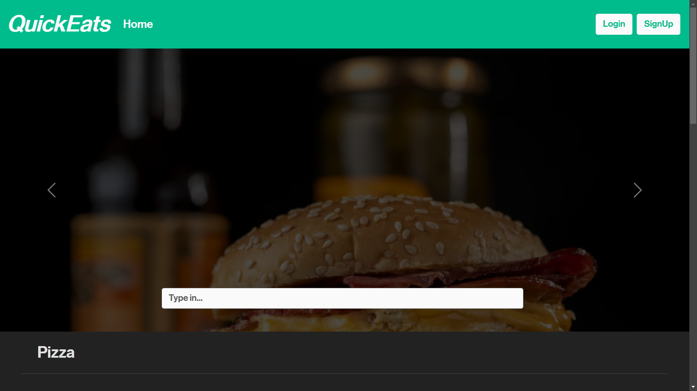
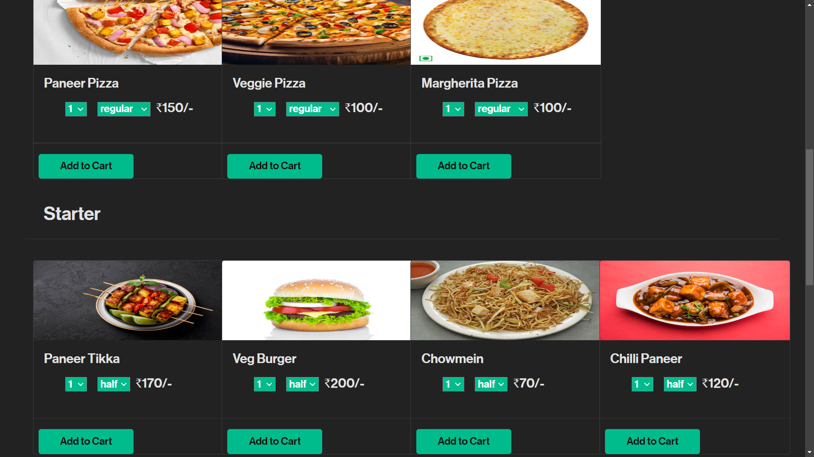

# QuickEats - Food Delivery Application

## Overview

QuickEats is a responsive single-page food delivery application built using the MERN Stack (MongoDB, Express.js, React.js, Node.js). It provides users with a seamless experience, allowing them to browse and select food items, specify quantities, and complete orders.

## Features

- **User Authentication:** Secure user authentication system to protect user data.
- **Item Selection:** Intuitive interface for selecting food items and specifying quantities.
- **Cart Management:** Users can easily manage their shopping cart, add or remove items.
- **Order History:** Keep track of past orders with an order history feature.

## Tech Stack

- Frontend: React.js, Bootstrap
- Backend: Node.js, Express.js
- Database: MongoDB Atlas

## How to Run

1. Clone the repository: `git clone <repository-url>`
2. Navigate to the root folder: `cd <project-folder>`
3. Install dependencies: `npm install`
4. Start the application: `npm start`
5. For the backend, navigate to the backend folder: `cd backend`
6. Run the backend server: `nodemon .\index.js`

Make sure to replace `<repository-url>` and `<project-folder>` with your actual repository URL and project folder name.

## Contribution

Contributions are welcome! If you find any issues or have suggestions for improvement, feel free to open an issue or create a pull request.

